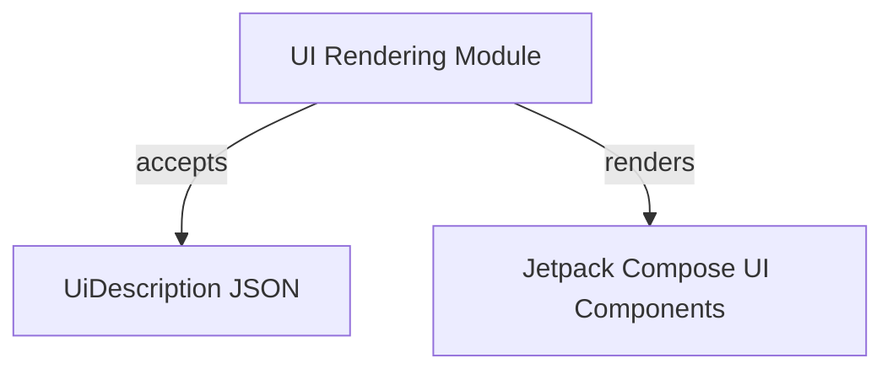
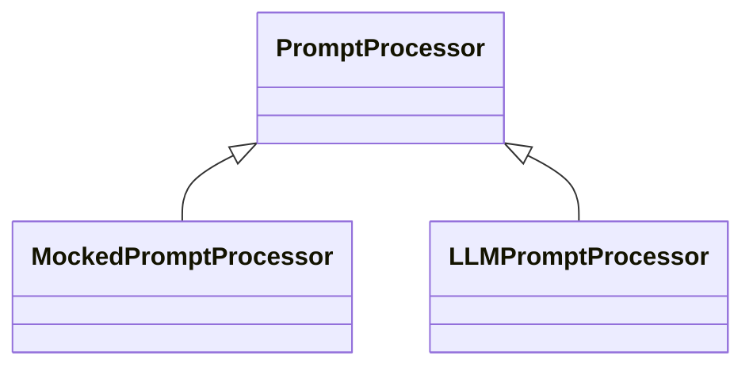
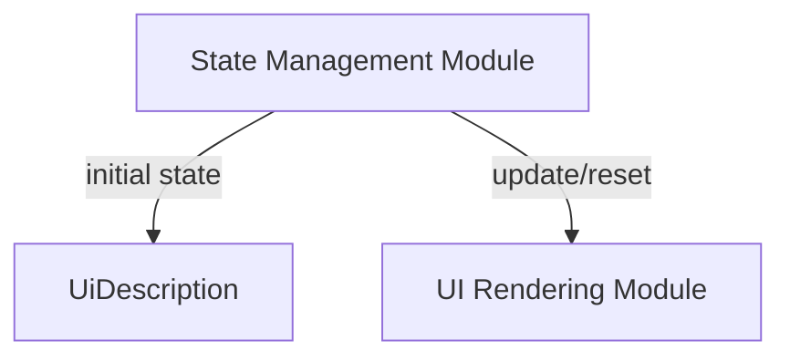
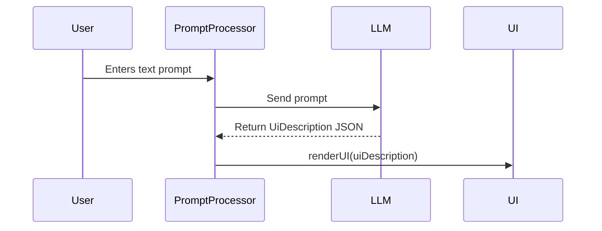
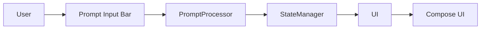

# Architecture.md — Mobile UI Playground (Kotlin Jetpack Compose)

## Introduction

This document describes the architecture of a **mobile UI playground** built entirely in Kotlin using Jetpack Compose. The application allows users to update the UI via **natural language commands**, either via **predefined prompts** or **LLM-generated structured instructions**.

The design follows **John Ousterhout's software philosophy**, emphasizing **deep modules, information hiding, and pulling complexity downwards**.

The document is structured to give enough context for an LLM to generate **high-level implementation tasks** with mid-level guidance, interfaces, diagrams, and optional low-level subtasks.

---

## High-Level Modules Overview

| Module | Responsibility | Interfaces | Notes |
|--------|---------------|------------|-------|
| **UI Rendering Module** | Convert structured `uiDescription` JSON into Jetpack Compose UI | `renderUI(uiDescription: UiDescription)` | Deep module; hides Compose details |
| **Prompt Processing Module** | Convert user prompt text → structured `uiDescription` | `processPrompt(prompt: String): UiDescription` | Pluggable strategy: Mocked or LLM-backed |
| **State Management Module** | Store, update, reset UI state | `getInitialState()`, `getCurrentState()`, `updateState(ui: UiDescription)`, `resetState()` | Single source of truth; in-memory only |

---

## Module 1 — UI Rendering Module

Purpose: Render a structured UI (uiDescription) using Jetpack Compose.


### Interface

```kotlin
fun renderUI(uiDescription: UiDescription)
```

Responsibilities
•	Accepts a JSON-like data structure describing components.
•	Handles conversion to Compose UI elements internally.
•	Supports future extensions without affecting other modules.

```json
{
  "components": [
    { "type": "title", "text": "My Profile" },
    { "type": "background", "color": "blue" },
    { "type": "card", "properties": { "backgroundColor": "white" } },
    { "type": "button", "text": "Save", "action": "saveProfile" }
  ]
}
```

Suggested Extended Components
•	TextInput, ProfileImage, DashboardChart, ToggleSwitch, ProgressBar
•	Fun extras: AnimatedCard, ColorPicker, InteractiveList



## Module 2 — Prompt Processing Module

Purpose: Convert user text input into structured uiDescription.

### Interface

```kotlin
interface PromptProcessor {
    fun processPrompt(promptText: String): UiDescription
}
```

### Strategy Pattern


	•	MockedPromptProcessor: Returns predefined JSON from /assets/prompts.json.
	•	LLMPromptProcessor: Calls OpenAI API (or other free-tier LLMs: Cohere, Mistral) to generate uiDescription.

## Predefined Prompts Schema
```json
[
  {
    "prompt": "Make background blue",
    "uiDescription": {
      "components": [
        { "type": "background", "color": "blue" }
      ]
    }
  },
  {
    "prompt": "Add a profile card",
    "uiDescription": {
      "components": [
        { "type": "card", "properties": { "backgroundColor": "white", "title": "Profile" } }
      ]
    }
  }
]
```

## Module 3 — State Management Module

Purpose: Maintain current UI state and allow reset to initial state.

### Interface
```kotlin
interface UiStateManager {
    fun getInitialState(): UiDescription
    fun getCurrentState(): UiDescription
    fun updateState(newUi: UiDescription)
    fun resetState()
}
```

Responsibilities
•	Hold initial hardcoded UI state.
•	Update current UI state dynamically.
•	Reset to initial state on user command.

Diagram (Mermaid)



JSON Layout Instruction Format
•	Flexible and extensible; allows adding new component types and properties without breaking existing code.
•	Example:

```json
{
  "components": [
    {
      "type": "title",
      "text": "Dashboard"
    },
    {
      "type": "chart",
      "properties": {
        "chartType": "bar",
        "data": [1,2,3,4]
      }
    },
    {
      "type": "button",
      "text": "Refresh",
      "action": "refreshData"
    }
  ]
}
```
LLM Integration (Optional)
•	OpenAI: Free-tier available; call API to generate structured JSON.
•	Cohere: Free-tier for lightweight usage.
•	Mistral: Free-tier models for small prompts.



Testing & Debugging Guidance
•	Use Jetpack Compose Testing for UI verification.
•	Use unit tests for state module:

```kotlin
@Test
fun testUpdateState() {
    val manager = UiStateManagerImpl(initialState)
    manager.updateState(newUi)
    assertEquals(newUi, manager.getCurrentState())
}
```

	•	Validate JSON schema for predefined prompts.
	•	Include integration tests to verify prompt → UI rendering.

Diagram: Module Interaction (Mermaid)


High-Level Implementation Tasks (Example)

Task 1: Implement UI Rendering Module
•	Mid-level description: Render structured JSON components into Jetpack Compose UI.
•	Interfaces: renderUI(uiDescription)
•	Diagram: see UI Rendering Module Mermaid
•	Optional low-level: map title, card, button, textInput to Compose components.

Task 2: Implement Prompt Processing Module
•	Mid-level description: Accept text input, return UiDescription.
•	Implement strategy pattern for Mocked and LLM-based processors.
•	Diagram: see PromptProcessor classDiagram

Task 3: Implement State Management Module
•	Mid-level description: Store initial state, update current state, reset.
•	Interfaces: UiStateManager methods.
•	Diagram: see State Management Module Mermaid

Task 4: Predefined Prompts JSON Handling
•	Mid-level: Load, parse, and match user prompts.
•	Validate JSON schema.

Task 5: LLM Integration (Optional)
•	Mid-level: Implement client for OpenAI / Cohere / Mistral.
•	Map LLM output → UiDescription.

Task 6: Testing & Validation
•	Mid-level: Unit tests for state, schema validation, Compose UI tests.
•	Optional: Integration test for prompt → UI.

⸻

Notes
•	All components in-memory, no backend.
•	Reset always reverts to initial hardcoded state.
•	Architecture supports future extensions, e.g., additional components or LLM backends.
•	Diagrams guide task decomposition for LLM-generated implementations.